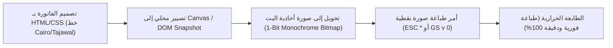

# QuazLink ERP & Retail Engine — Architecture & Implementation Plan (Enterprise Edition)

> **الرؤية الاستراتيجية:** تحويل QuazLink من مجرد منصة أتمتة تسويقية إلى **نظام التشغيل المتكامل لإدارة ونمو التجارة (All-in-One Business OS)**.
> يجمع النظام بين سرعة وموثوقية برامج الكاشير المحلية (Local-First Offline POS) وقوة منصة QuazLink السحابية في أتمتة الفواتير والواتساب والتسويق الذكي.

---

## 0. المبادئ الحاكمة وخيارات الأعمال (Business & Core Mandates)

### 1. نموذج الترخيص واقتصاديات الخدمة (Dual-Licensing & Cloud Economics):
لحماية استدامة المشروع وتفادي تحمل تكاليف استهلاك الـ APIs والسيرفرات بدون عائد دوري:

| الباقة | نمط التشغيل | نموذج التسعير | الخدمات المضمنة وتكاليف الأتمتة |
| :--- | :--- | :--- | :--- |
| **باقة الاشتراك السحابي المتجدد (Cloud & Hybrid SaaS)** | محلي + مزامنة سحابية مستمرة | اشتراك شهري أو سنوي متجدد | برنامج الكاشير + النسخ الاحتياطي السحابي التلقائي + كوتة استهلاك شهرية لرسائل الواتساب والـ AI (`gemini-3.5-flash-lite`) + لوحة تقارير ويب للهاتف. |
| **باقة الشراء الدائم (Lifetime Offline License)** | محلي مستقل على جهاز التاجر | دفعة واحدة لمرة واحدة (One-Time) | برنامج الكاشير والمخازن محلياً مدى الحياة + رخصة مقفلة بالـ Hardware ID + تحديثات أمنية دورية. <br>⚠️ **الخدمات السحابية كإضافة اختيارية (Add-on Credits):** أتمتة الواتساب وتوليد الإعلانات تكون عبر باقات شحن رصيد مسبق الدفع (Prepaid Bundles). |

### 2. نطاق المرحلة الأولى (Phase 1 Target Scope):
* **الأنشطة المستهدفة:** محلات الكمبيوتر والإلكترونيات، الأجهزة المنزلية، وتجارة التجزئة والجملة العامة (Retail & Wholesale).
* **المتطلبات الأساسية:**
  * فواتير البيع السريعة (POS) والطباعة الحرارية الفورية (Thermal Receipts).
  * فواتير الشراء، إدارة الموردين، وإدخال البضائع والباركودات.
  * إدارة المخزون، حدود النواقص، والأرقام التسلسلية الاختيارية (Serials / IMEI) للقطع الإلكترونية وأجهزة اللابتوب والهواتف مع متابعة فترات الضمان.
  * سجلات العملاء، حسابات الآجل (الديون والتحصيل)، وكشوف الحسابات.
  * تأجيل أنشطة المطاعم (طاولات، مطبخ) والصيدليات للمراحل التالية بعد اكتمال النواة.

### 3. مبدأ العزل الصارم بنسبة 100% (Strict Isolation Mandate & Zero Side Effects):
* **عدم لمس الـ Desktop Runner القائم نهائياً:** تطبيق الأتمتة الحالي `apps/desktop-agent` (الذي يدير عقد فيسبوك، إنستغرام، وواتساب) يظل مستقلاً 100% كما هو دون تعديل أي سطر فيه، منعاً لأي Regression أو تعطيل للمهام التشغيلية الحية.
* **إنشاء تطبيق مستقل تماماً (`apps/pos-client`):**
  * يتم بناء برنامج الكاشير والمخازن الجديد داخل مجلد منفصل كلياً: **`apps/pos-client`**.
  * يمتلك `package.json` خاص به، وإعدادات Electron / React / Vite خاصة به، وقاعدة بيانات SQLite محلية معزولة.
  * لا يوجد أي تداخل في الـ Dependencies أو العمليات أو الـ Build بينه وبين أي تطبيق آخر في المشروع.
  * في المستقبل، أي تواصل بين برنامج الكاشير ومنصة QuazLink يتم عبر بروتوكولات خارجية قياسية (Standard REST / WebSocket APIs).

### 4. الجاهزية لمنظومة الفاتورة والإيصال الإلكتروني (ETA Compliance Readiness):
* مواءمة قاعدة البيانات من اليوم الأول لدعم متطلبات مصلحة الضرائب المصرية (B2B E-Invoice & B2C E-Receipt):
  * حقول الضرائب التفصيلية: ضريبة القيمة المضافة (VAT 14%)، جدول، ضريبة أرباح تجارية وصناعية (خصم المنبع).
  * حقول الإرسال: `etaUuid`, `submissionStatus`, وتوليد الـ QR Code القياسي المشفر (Base64 TLV Format).

---

## 1. المعمارية الهندسية ومواجهة فخ المزامنة (Architecture & Sync Resolution)

```mermaid
graph TD
    subgraph ClientDevice ["جهاز التاجر (Local POS Terminal)"]
        UI["واجهة الكاشير السريعة (Keyboard-First POS UI)"]
        POSCore["محرك نقاط البيع المحلي (Express / Desktop Controller)"]
        LocalDB[("قاعدة البيانات المحلية (SQLite / ULID / UUID)")]
        RasterEngine["محرك تصيير الإيصالات الرسومي (Canvas-to-Raster Engine)"]
        HWLayer["طبقة العتاد المباشرة (ESC/POS Raw, Barcode HID, Drawer)"]
        SyncWorker["وكيل المزامنة الذكي (Conflict-Free Sync Worker)"]

        UI --> POSCore
        POSCore --> LocalDB
        POSCore --> RasterEngine --> HWLayer
        SyncWorker <--> LocalDB
    end

    subgraph QuazLinkCloud ["سحابة QuazLink السحابية (api.quazlink.site)"]
        CloudGateway["بوابة المزامنة والترخيص (Sync Gateway)"]
        CloudDB[("قاعدة البيانات المركزية (PostgreSQL)")]
        AutoEngine["محرك أتمتة الواتساب والسوشيال ميديا (Existing Platform)"]
        WebDashboard["لوحة متابعة صاحب العمل عبر الويب والموبايل"]

        CloudGateway <--> CloudDB
        CloudGateway --> AutoEngine
        WebDashboard <--> CloudDB
    end

    SyncWorker -.->|Delta Sync via HTTPS/WSS (Append-Only)| CloudGateway
```

### 🛡️ بروتوكول حل تعارضات المزامنة (Zero-Conflict Sync Protocol):
1. **المفاتيح الأساسية (Primary Keys):** اعتماد `UUID v4` أو `ULID` (Time-sortable) لكافة الجداول محلياً وسحابياً من اليوم الأول لمنع أي تصادم في الـ IDs.
2. **الترقيم المركب للفواتير (Composite Invoice Numbers):**
   * صيغة الترقيم لمنع التكرار بين الفروع وأجهزة الكاشير:
     `INV-{BranchCode}-{PosID}-{YYYYMMDD}-{DailyCounter}`
     (مثال: `INV-B01-POS01-20261005-0042`).
3. **سجل الحركات المتراكمة (Append-Only Event Ledger):**
   * حركات المخزون والمدفوعات لا يتم تعديلها بالمسح أو التعديل المباشر، بل تُسجل كحركات متتالية (Append-Only Movements)، وتُجمع أرصدة الحسابات منها برمجياً.
4. **سلطة السيرفر وسرعة التعديل (Server Authority vs Last Write Wins):**
   * **الأسعار والمخزون الحساس:** سلطة السيرفر (Server Authority) عند وجود تعارض متزامن.
   * **البيانات الوصفية للعملاء:** قاعدة التعديل الأحدث (Last Write Wins) بالاعتماد على طابع زمني بدقة الميلي ثانية (`updatedAtMs`).

---

## 2. حل معضلة الطباعة الحرارية بالعربية (Canvas-to-Raster ESC/POS Pipeline)

### تشخيص المشكلة:
الطابعات الحرارية الشائعة في السوق (Xprinter, Rongta, Sunmi, Epson) تفشل في دعم صفحات الترميز العربية (Codepages: Windows-1256 / CP864)، مما ينتج حروفا متقطعة أو معكوسة الاتجاه عند إرسال نصوص عادية (Raw Text Commands).

### الحل الهندسي المعتمد (Canvas-to-Raster Pipeline):


1. **تصميم الفاتورة كـ HTML/CSS وأبعاد الـ Canvas الثابتة:**
   * **عرض 80mm:** تحديد عرض ثابت للكانفاس بمقدار **`576px`** (بمعيار 203 DPI و 8 نقاط/مم على عرض طباعة فعلي 72مم).
   * **عرض 58mm:** تحديد عرض ثابت للكانفاس بمقدار **`384px`** (على عرض طباعة فعلي 48مم).
   * استخدام خطوط عربية واضحة ومقروءة (Cairo أو Tajawal) مع ضبط الهوامش والألوان (أبيض وأسود نقي).
2. **محرك التحويل فائق السرعة (Ultra-Fast Sub-100ms Rasterization):**
   * استخدام محرك تصيير خفيف محلياً (مثل `node-canvas` أو أداة رندرة داخلية) يحول الفاتورة من HTML إلى Monochrome 1-Bit Bitmap في غضون **50 إلى 100 ميلي ثانية فقط**، لتجنب أي تأخير عند خروج الفاتورة للكاشير.
3. **إرسال أمر الرسم النقطي (ESC/POS Raster Bit Image):**
   * إرسال الصورة كـ Raster Bit Bytes عبر منفذ الـ USB أو السيريال أو الشبكة LAN بأمر `GS v 0` أو `ESC *`.
   * **النتيجة:** طباعة عربية سليمة 100%، دعم كامل لشعار المتجر (Logo)، وطباعة QR Code فائق الدقة بدون أي اعتماد على الخطوط الداخلية للطابعة.

---

## 3. البنية البرمجية لقواعد البيانات (Data Model Schema)

```prisma
// 1. ملف النشاط التجاري والترخيص
model BusinessProfile {
  id              String   @id @default(uuid())
  businessName    String
  branchCode      String   @default("B01")
  posTerminalId   String   @default("POS01")
  phone           String
  address         String?
  taxNumber       String?  // رقم التسجيل الضريبي
  receiptFooter   String?  // شروط الاسترجاع وسياسة المحل
  currency        String   @default("EGP")
  licenseKey      String
  licenseType     String   // "saas_subscription" | "lifetime_offline"
  hardwareId      String?  // Machine GUID لربط الترخيص بالعتاد
  createdAt       DateTime @default(now())
  updatedAt       DateTime @updatedAt
}

// 2. تصنيفات المنتجات
model Category {
  id          String    @id @default(uuid())
  name        String
  products    Product[]
  createdAt   DateTime  @default(now())
}

// 3. المنتجات والمخزون
model Product {
  id                 String           @id @default(uuid())
  barcode            String?          @unique
  sku                String?          @unique
  name               String
  categoryId         String?
  category           Category?        @relation(fields: [categoryId], references: [id])
  buyPrice           Float            @default(0.0)
  sellPriceRetail    Float            // سعر البيع قطاعي
  sellPriceWholesale Float?           // سعر البيع جملة
  stockQuantity      Float            @default(0.0)
  minStockAlert      Float            @default(3.0)
  unit               String           @default("قطعة")
  imageUrl           String?
  hasSerial          Boolean          @default(false) // تفعيل إلزامية السيريال للأجهزة
  serials            ProductSerial[]
  invoiceItems       InvoiceItem[]
  movements          StockMovement[]
  createdAt          DateTime         @default(now())
  updatedAt          DateTime         @updatedAt
}

// 4. الأرقام التسلسلية للأجهزة والإلكترونيات (Serials / IMEI) وتتبع المرتجعات
model ProductSerial {
  id              String       @id @default(uuid())
  productId       String
  product         Product      @relation(fields: [productId], references: [id])
  serialNumber    String       @unique
  status          String       @default("in_stock") // "in_stock" | "sold" | "returned" | "defective"
  invoiceId       String?      // فاتورة البيع المربوط بها
  invoice         Invoice?     @relation("InvoiceSoldSerials", fields: [invoiceId], references: [id])
  returnInvoiceId String?      // فاتورة المرتجع إن وجد
  warrantyMonths  Int          @default(12) // مدة الضمان بالشهور
  soldAt          DateTime?
  returnedAt      DateTime?
  createdAt       DateTime     @default(now())
}

// 5. جهات الاتصال (العملاء والموردين)
model Contact {
  id          String    @id @default(uuid())
  type        String    // "customer" | "supplier"
  name        String
  phone       String
  taxId       String?   // للعملاء التجاريين (B2B)
  address     String?
  balance     Float     @default(0.0) // رصيد الحساب (مدين / دائن)
  invoices    Invoice[]
  payments    Payment[]
  createdAt   DateTime  @default(now())
  updatedAt   DateTime  @updatedAt
}

// 6. الفواتير (بيع وشراء)
model Invoice {
  id               String          @id @default(uuid())
  invoiceNumber    String          @unique // مثال: INV-B01-POS01-20261005-0042
  type             String          // "sale" | "purchase" | "sale_return" | "purchase_return"
  paymentMethod    String          @default("cash") // "cash" | "credit" | "visa" | "partial"
  contactId        String?
  contact          Contact?        @relation(fields: [contactId], references: [id])
  subtotal         Float           // الإجمالي قبل الخصم والضريبة
  discountAmount   Float           @default(0.0)
  taxVat14         Float           @default(0.0) // قيمة الضريبة 14%
  taxTable         Float           @default(0.0) // ضريبة الجدول إن وجدت
  finalAmount      Float           // الإجمالي النهائي المستحق
  paidAmount       Float           @default(0.0)
  remainingAmount  Float           @default(0.0)
  notes            String?
  // حقول جاهزية الفاتورة والإيصال الإلكتروني (ETA Compliance)
  etaUuid          String?
  etaStatus        String          @default("not_applied") // "not_applied" | "pending" | "valid" | "invalid"
  etaSubmissionTime DateTime?
  // حقول الأتمتة والسحابة
  whatsappStatus   String?         // "pending" | "sent" | "failed" | "whatsappless"
  syncedToCloud    Boolean         @default(false)
  items            InvoiceItem[]
  serials          ProductSerial[]
  payments         Payment[]
  createdAt        DateTime        @default(now())
}

// 7. بنود الفاتورة
model InvoiceItem {
  id           String   @id @default(uuid())
  invoiceId    String
  invoice      Invoice  @relation(fields: [invoiceId], references: [id], onDelete: Cascade)
  productId    String
  product      Product  @relation(fields: [productId], references: [id])
  quantity     Float
  unitPrice    Float
  totalPrice   Float
  serialNumber String?  // السيريال المربوط بالبند إن وجد
}

// 8. سجل المدفوعات والتحصيل (Append-Only Ledger)
model Payment {
  id          String   @id @default(uuid())
  contactId   String
  contact     Contact  @relation(fields: [contactId], references: [id])
  invoiceId   String?
  invoice     Invoice? @relation(fields: [invoiceId], references: [id])
  amount      Float
  type        String   // "receipt" (قبض) | "payment" (صرف)
  method      String   @default("cash")
  notes       String?
  createdAt   DateTime @default(now())
}

// 9. حركة المخزون (Append-Only Events)
model StockMovement {
  id           String   @id @default(uuid())
  productId    String
  product      Product  @relation(fields: [productId], references: [id])
  type         String   // "sale" | "purchase" | "adjustment" | "return"
  quantity     Float    // قيمة التغير (+ أو -)
  balanceAfter Float
  referenceId  String?  // رقم الفاتورة
  createdAt    DateTime @default(now())
}
```

---

## 4. تجربة المستخدم في شاشة الكاشير السريع مع الأجهزة والسيريال (POS & Serial Flow)

### أ) نافذة إدخال السيريال الإلزامية (Serial Prompt Guard):
* عند تمرير باركود منتج معلم بخيار `hasSerial = true` (مثل لابتوب أو كارت شاشة أو هاتف):
  1. لا يُضاف الصنف مباشرة، بل تنبثق فوراً نافذة تركيز بصرية: *"امسح أو أدخل السيريال / IMEI الخاص بالجهاز"*.
  2. يتم فحص السيريال في قاعدة البيانات المحلية:
     * إذا كان متاحاً (`status == "in_stock"`): يتم ربطه بالبند فوراً وإضافته للفاتورة مع تحويل حالته لـ `sold`.
     * إذا كان مباعاً مسبقاً أو غير موجود: يظهر تنبيه فوري لمنع الازدواجية والتلاعب.
  3. يطبع السيريال في الإيصال الحراري أسفل الصنف مع مدة الضمان.

### ب) معالجة السيريال في المرتجعات (Returns Flow & Serial Integrity):
* عند إدخال **مرتجع بيع (Sale Return)**:
  1. يُطلب من الكاشير مسح أو اختيار السيريال المرتجع.
  2. يتحقق النظام من أن السيريال كان مسجلاً كـ `sold` في فاتورة البيع الأصلية.
  3. يُخيّر الكاشير بين حالتين:
     * **سليم وقابل للبيع:** يعاد السيريال للمخزن المتاح وتتحول حالته إلى `in_stock` ويزداد رصيد المخزن تلقائياً دون تكرار الـ ID.
     * **تالف أو معيوب (Defective):** تتحول حالته إلى `defective` أو `returned` ولا يدخل في الرصيد القابل للبيع، ويربط بحقل `returnInvoiceId`.
* عند **مرتجع شراء للمورد (Purchase Return)**:
  * يتم حظر السيريال وخروجه من المخزن بصفة نهائية مع ربطه بفاتورة مرتجع الشراء.

### ج) حماية فقدان التركيز لمسدس الباركود (Global Barcode HID Listener & Focus Loss Protection):
* مسدسات الباركود تعمل كـ HID Keyboard ترسل دفقات أحرف فائقة السرعة (< 30ms بين كل حرف) وتنتهي بزر `Enter`.
* **المشكلة:** إذا نقر الكاشير بالخطأ خارج خانة البحث، تسقط ضربة الباركود في الفراغ أو تفتح نوافذ متصفح عشوائية.
* **الحل الهندسي المنفذ:**
  * وضع **Global Keydown Listener** على مستوى النافذة الرئيسية (`window`).
  * تجميع الأحرف المتتالية في بافر ذكي (Timing Buffer)؛ إذا كانت السرعة الزمنية مطابقة للمسدس وانتهت بـ `Enter`، يقوم المستمع بـ `e.preventDefault()` فوراً وتوجيه الباركود مباشرة لسلة المشتريات وإضافة الصنف حتى لو كان الفوكس على أي عنصر آخر، مما يلغي تماماً حاجة الكاشير للمس الفأرة.

---

## 5. ميزات الأتمتة الحصرية لمنصة QuazLink (The Unfair Advantage)

### أ) واتساب الفواتير الآلي (Instant Smart WhatsApp Invoice):
* بمجرد إتمام الفاتورة، يُرسل ملخص أنيق مع رابط الفاتورة الإلكترونية لرقم العميل عبر عقدة واتساب القائمة، مع فحص تلقائي عبر `whatsapplessStore` لتخطي الأرقام غير المسجلة في 0.001 ثانية.
* لمشتري باقة الـ Lifetime: يتم احتساب الرسائل من رصيد الكريديت المسبق الدفع (Add-on Credits).

### ب) أتمتة تسويق المنتجات الجديدة (One-Click AI Social Campaign):
* زر في بطاقة الصنف: `✨ ترويج الصنف على السوشيال ميديا`.
* يقوم نموذج `gemini-3.5-flash-lite` بصياغة بوست تسويقي احترافي بالعربية، مع الهاشتاجات وسعر العرض، وإرساله فوراً لفيسبوك وإنستغرام.

---

## 6. خطة التنفيذ المعدلة بالتوازي (Optimized Implementation Roadmap)

بناءً على التوصية بتقديم اختبار العتاد ليكون بالتوازي مع الواجهة لبناء الثقة والتحقق الميداني الفوري:

| المرحلة | المسار والأهداف | التعيين والمسؤوليات | الحالة والاعتماد |
| :--- | :--- | :--- | :--- |
| **المرحلة 1: النواة وقاعدة البيانات (Core & DB)** | بناء ملفات المخطط للـ SQLite المحلي، المفاتيح الموحدة (ULID/UUID)، والترقيم المركب للفواتير. | `db-modeler` & `backend-architect` | ✅ مكتملة ومختبرة بنسبة 100% |
| **المرحلة 2 (توازي أ): شاشة الكاشير السريعة (POS Express UI)** | واجهة البيع السريعة بالاختصارات (F1-F12)، دعم الباركود، نافذة فحص السيريال، حساب الإجمالي والخصم والضرائب. | `frontend-ui` & `frontend-logic` | ✅ مكتملة ومختبرة بنسبة 100% |
| **المرحلة 2 (توازي ب): العتاد والطباعة الحرارية (Hardware & ESC/POS)** | بناء محرك `Canvas-to-Raster` لطباعة العربية والـ QR واللوجو 100%، نبضة فتح درج النقدية، وقارئ الباركود. | `desktop-automator` | ✅ مكتملة ومختبرة بنسبة 100% (2ms) |
| **المرحلة 3: إدارة المخزن والموردين والأجهزة (Inventory, Serials & CRM)** | إدارة الأصناف، تتبع السيريالات والضمان، تتبع النواقص، حسابات العملاء والموردين وسداد الآجل. | `backend-api` & `frontend-logic` | ✅ مكتملة ومختبرة بنسبة 100% |
| **المرحلة 4: ربط الأتمتة (WhatsApp & Social Sync)** | ربط فواتير الـ POS مع `whatsapp-node`، وإطلاق ميزة ترويج الأصناف عبر السوشيال ميديا. | `automation-manager` & `workflow-automator` | ✅ مكتملة ومختبرة بنسبة 100% |
| **المرحلة 5: المزامنة السحابية، التراخيص، النسخ الاحتياطي ومنظومة الضرائب المصرية ETA** | بصمة العتاد Hardware ID، ترخيص Lifetime و SaaS، محفظة رصيد الكريديت والكوبونات، نسخ احتياطي ذري واستعادة .qzbk، المزامنة السحابية المرنة، ومنظومة الإيصال الإلكتروني ETA TLV QR. | `backend-security` & `cloud-architect` | ✅ مكتملة ومختبرة بنسبة 100% |
